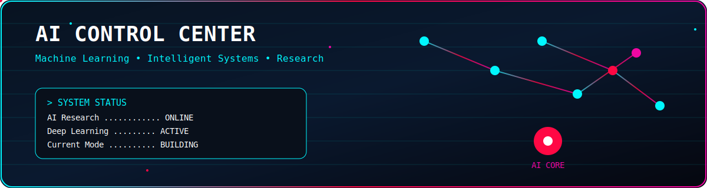
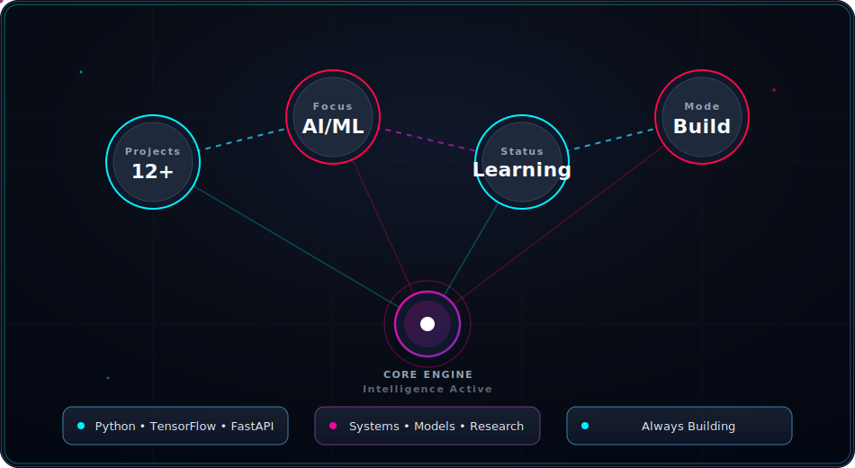

<!-- ===================================================== -->
<!-- HEADER -->
<!-- ===================================================== -->

  

  

  
  
  

---

<!-- SECTION: AI CONTROL CENTER -->

  

  

---

<!-- SECTION: ABOUT ME -->

  

| Current Focus | Core Interests |
|:-----------------|:------------------|
| Building AI systems and intelligent software from first principles. | Machine Learning |
| Time-series forecasting | Deep Learning |
| Generative AI | Generative AI |
| Algorithms from scratch | Mechanistic Interpretability |
| Backend AI Systems | AI System Design |

 

| Collaboration | Currently Learning |
|:----------------|:----------------------|
| Open Source AI | Deep Learning |
| Research Projects | MLOps |
| AI Infrastructure | Distributed Systems |
| Intelligent Systems | LLM Engineering |

---

<!-- SECTION: TECH STACK -->

  

  

  
  
  

  

  
  
  
  
  

  

  
  
  
  
  
  

---

<!-- SECTION: AI DASHBOARD -->

  

  

---

<!-- SECTION: GITHUB ANALYTICS -->

  

  
  

  

---

<!-- SECTION: CONNECT -->

  

  
  

---

<!-- SECTION: DEV PHILOSOPHY -->

  

  > <i>"Understanding intelligence requires curiosity, mathematics, experimentation, and relentless iteration."</i>

---

  

