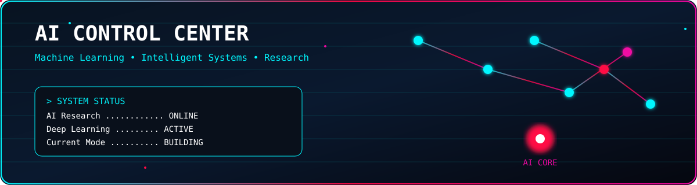
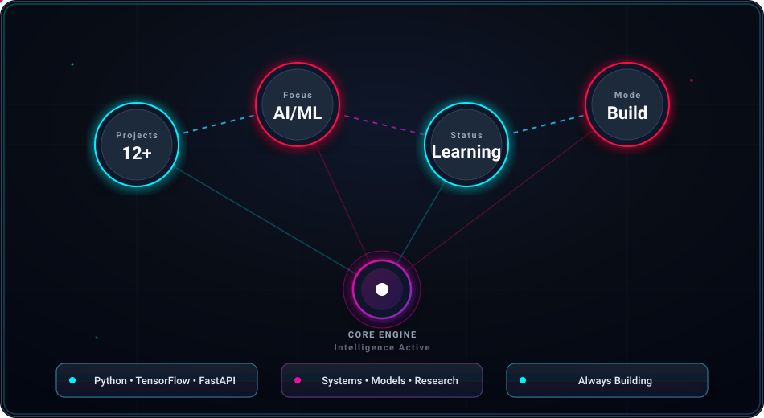

<!-- ===================================================== -->
<!-- HEADER -->
<!-- ===================================================== -->

<p align="center">
  
</p>

<p align="center">
  
</p>

<p align="center">
  
  
  
  
</p>

---

<!-- SECTION: AI CONTROL CENTER -->
<p align="center">
  
</p>

<p align="center">
  
</p>

---

<!-- SECTION: ABOUT ME -->
<div id="about-me"></div>
<p align="center">
  
</p>

<p align="center">
  <i>I don't treat models as magic. I treat them as systems — data in, a decision out, and a reason you can inspect.</i>
</p>

<p align="center">
  AI Engineering student in Mumbai. I build the full loop: train the model, serve it, and show <b>why</b> it decided.<br/>
  Recent systems include
  <a href="https://github.com/KrishKamra/PhishPhage">PhishPhage</a> (explainable phishing forensics),
  a <a href="https://github.com/KrishKamra/dga-detection-system">DGA detection engine</a>,
  and a <a href="https://github.com/KrishKamra/higgs-collision-classifier">Higgs collision classifier</a>.
</p>

```yaml
name:      Krish Kamra
based:     Mumbai
role:      AI Engineering student
building:  detection & inference systems with an explainability layer
loop:      data → train → serve → explain
learning:  LLM engineering · agentic systems · MLOps
open_to:   OSS AI · research experiments · intelligent infrastructure
```

---

<!-- SECTION: TECH STACK -->
<div id="tech-stack"></div>
<p align="center">
  
</p>

<p align="center">
  <a href="https://skillicons.dev">
    
  </a>
</p>

---

<!-- SECTION: AI DASHBOARD -->
<div id="ai-dashboard"></div>
<p align="center">
  
</p>

<p align="center">
  
</p>

---

<!-- SECTION: SYSTEM TELEMETRY -->
<!--
  Do not use github-readme-stats.vercel.app (503) or
  github-readme-stats-sigma-five.vercel.app (PAT_1 error).
  Live: github-profile-summary-cards + streak-stats.demolab.com
  Snake: output branch after .github/workflows/snake.yml runs.
-->
<div id="github-analytics"></div>
<p align="center">
  
</p>

<p align="center">
  
</p>

<p align="center">
  
</p>

<p align="center">
  
  
</p>

<p align="center">
  <picture>
    <source media="(prefers-color-scheme: dark)" srcset="https://raw.githubusercontent.com/KrishKamra/KrishKamra/output/github-contribution-grid-snake-dark.svg"/>
    <source media="(prefers-color-scheme: light)" srcset="https://raw.githubusercontent.com/KrishKamra/KrishKamra/output/github-contribution-grid-snake.svg"/>
    
  </picture>
</p>

---

<!-- SECTION: DEV PHILOSOPHY -->
<div id="dev-philosophy"></div>
<p align="center">
  
</p>

<p align="center">
  
</p>

---

<!-- SECTION: CONNECT -->
<div id="connect"></div>
<p align="center">
  
</p>

<p align="center">
  <a href="https://linkedin.com/in/krish-kamra-5b81b3313">
    
  </a>
  <a href="mailto:krishkamra@gmail.com">
    
  </a>
</p>

<p align="center">
  
</p>
